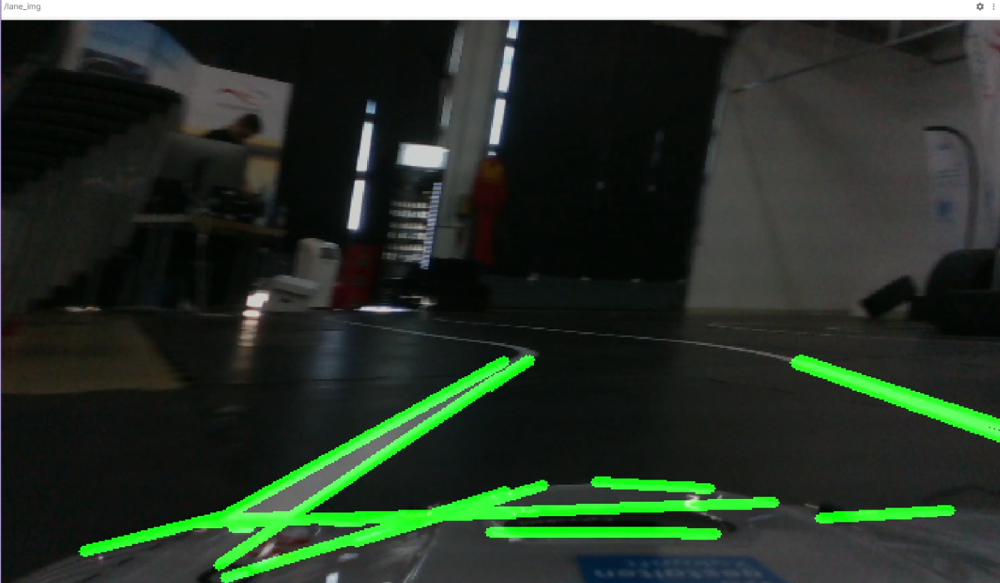

# `lane_following_cam` package
Lane following based on camera as a ROS 2 python package.  

[](https://docs.ros.org/en/humble/)
[](https://docs.ros.org/en/jazzy/)



## Packages and build

It is assumed that the workspace is `~/ros2_ws/`.

### Clone the packages
``` r
cd ~/ros2_ws/src
```
``` r
git clone https://github.com/robotverseny/lane_following_cam
```

### Build ROS 2 packages
``` r
cd ~/ros2_ws
```
``` r
colcon build --packages-select lane_following_cam --symlink-install
```

<details>
<summary> Don't forget to source before ROS commands.</summary>

``` bash
source ~/ros2_ws/install/setup.bash
```
</details>

## Run the package

Start the lane detection node with **compressed** or **raw** image, e.g.:

``` r
ros2 run lane_following_cam lane_detect --ros-args -p image_topic:=/image_raw/compressed -p raw_image:=false
```

``` r
ros2 run lane_following_cam lane_detect --ros-args -p image_topic:=/image_raw -p raw_image:=true
```

``` r
ros2 run lane_following_cam lane_detect --ros-args -p image_topic:=/camera/color/image_raw -p raw_image:=true
```

There are launch files as well: 

``` r
ros2 launch lane_following_cam example_bag.launch.py
```

``` r
ros2 launch lane_following_cam robot_raw1.launch.py
```

``` r
ros2 launch lane_following_cam robot_compressed1.launch.py
```


### Start the camera

``` r
ros2 launch usb_cam_launcher usb_cam_a.launch.py
```

``` r 
~/ros2_ws/src/lane_following_cam/shell/start_drivers.sh
```

## Use ROS 2 bag (mcap)

Link: [drive.google.com/drive/folders/181pcgmwZ5YjaCReB-aZJtW1JtxnJUaru?usp=sharing](https://drive.google.com/drive/folders/181pcgmwZ5YjaCReB-aZJtW1JtxnJUaru?usp=sharing)

```r
ros2 bag play runde_vdi_lausitz_1.mcap --loop
```

This bag file contains `/camera/color/image_raw` topic, so easiest way to use is:

``` r
ros2 launch lane_following_cam example_bag.launch.py
```